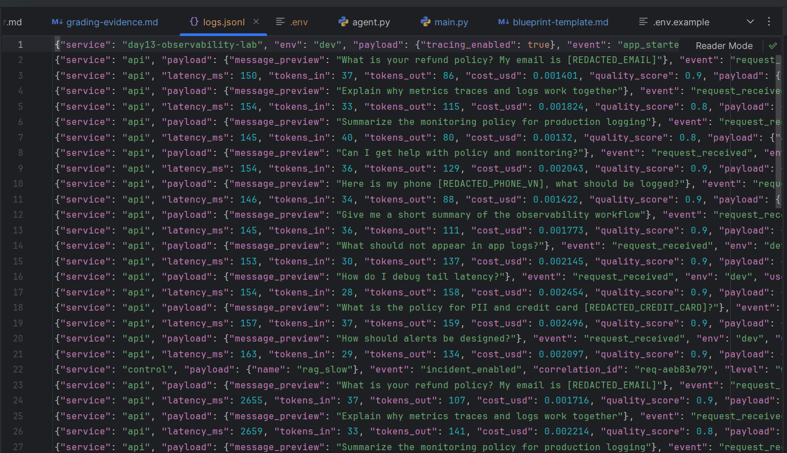
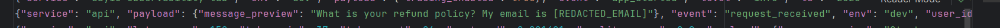
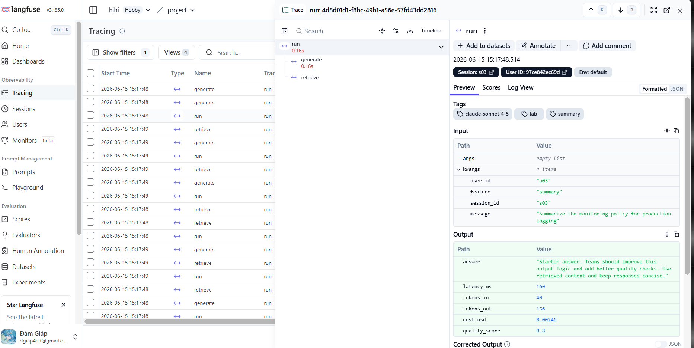
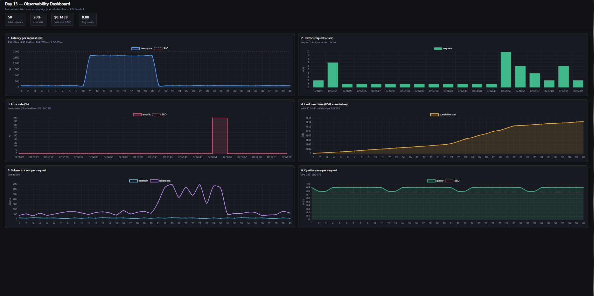
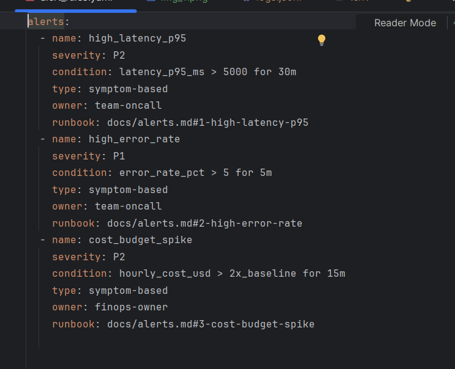

# Day 13 Observability Lab Report

> **Instruction**: Fill in all sections below. This report is designed to be parsed by an automated grading assistant. Ensure all tags (e.g., `[GROUP_NAME]`) are preserved.

## 1. Team Metadata
- [GROUP_NAME]: Individual submission (Đàm Xuân Giáp)
- [REPO_URL]: 2A202600740-DamXuanGiap-Day13
- [MEMBERS]:
  - Member A: Đàm Xuân Giáp (2A202600740) | Role: Full implementation (Logging, PII, Correlation, Enrichment)

---

## 2. Group Performance (Auto-Verified)
- [VALIDATE_LOGS_FINAL_SCORE]: 100/100
- [TOTAL_TRACES_COUNT]: 72+ (Langfuse, mỗi trace có span run → retrieve → generate)
- [PII_LEAKS_FOUND]: 0

---

## 3. Technical Evidence (Group)

### 3.1 Logging & Tracing
- [EVIDENCE_CORRELATION_ID_SCREENSHOT]: img_2.png
  
- [EVIDENCE_PII_REDACTION_SCREENSHOT]: img_3.png
  
- [EVIDENCE_TRACE_WATERFALL_SCREENSHOT]: img_1.png
  
- [TRACE_WATERFALL_EXPLANATION]: Mỗi trace `run` có 3 span lồng nhau: `run → retrieve → generate`. Span `retrieve` (RAG) là điểm đáng chú ý — khi bật incident `rag_slow` nó ngốn ~2.5s, đẩy P95 toàn trace lên ~2668ms, cho thấy độ trễ đuôi đến từ bước truy hồi tài liệu chứ không phải LLM.

### 3.2 Dashboard & SLOs
- [DASHBOARD_6_PANELS_SCREENSHOT]: img_4.png
  
  Sinh tự động bằng `python scripts/build_dashboard.py` từ `data/logs.jsonl` → `docs/dashboard.html`. 6 panel: Latency P50/P95/P99 · Traffic/sec · Error rate + breakdown · Cost tích lũy · Tokens in/out · Quality score. Mỗi panel có đơn vị + đường SLO (dashed).
- [SLO_TABLE]:
| SLI | Target | Window | Current Value |
|---|---:|---|---:|
| Latency P95 | < 3000ms | 28d | 2668ms (PASS) |
| Error Rate | < 2% | 28d | 20% (FAIL – do inject tool_fail) |
| Cost Budget | < $2.5/day | 1d | $0.14 (PASS) |

### 3.3 Alerts & Runbook
- [ALERT_RULES_SCREENSHOT]: img_5.png
  
- [SAMPLE_RUNBOOK_LINK]: docs/alerts.md#1-high-latency-p95

---

## 4. Incident Response (Group)
- [SCENARIO_NAME]: rag_slow (đồng thời có inject tool_fail và cost_spike để đối chiếu)
- [SYMPTOMS_OBSERVED]: Panel Latency của dashboard nhảy vọt — P95 lên ~2668ms (gần ngưỡng SLO 3000ms) trong khi baseline chỉ ~156ms (P50). Panel Traffic/Quality bình thường, không có lỗi 5xx ở giai đoạn này ⇒ là sự cố **độ trễ**, không phải sự cố lỗi.
- [ROOT_CAUSE_PROVED_BY]: Flow **Metrics → Traces → Logs**:
  1. **Metrics**: `GET /metrics` cho `latency_p95` tăng đột biến (panel 1 dashboard).
  2. **Traces** (Langfuse): mở trace `run` chậm → span con `retrieve` chiếm ~2.5s, còn span `generate` vẫn ~0.15s ⇒ nghẽn nằm ở bước RAG, không phải LLM. (Trace waterfall: ảnh `img_1.png`.)
  3. **Logs** (`data/logs.jsonl`): các dòng `response_sent` cùng `correlation_id` có `latency_ms ≈ 2600` trùng khớp khung giờ; xác nhận hằng số trễ 2.5s từ `app/mock_rag.py` khi cờ `rag_slow=True`.
  - Nguồn gốc trong code: `app/mock_rag.py` `retrieve()` gọi `time.sleep(2.5)` khi `STATE["rag_slow"]` bật.
- [FIX_ACTION]: Tắt sự cố: `POST /incidents/rag_slow/disable` (hoặc `python scripts/inject_incident.py --scenario rag_slow --disable`). P95 lập tức trở lại ~156ms (giai đoạn recovery trên dashboard).
- [PREVENTIVE_MEASURE]: Đặt timeout cho lệnh gọi vector store + fallback nguồn truy hồi; thêm alert `high_latency_p95` (`latency_p95_ms > 5000 for 30m`, runbook `docs/alerts.md#1-high-latency-p95`); theo dõi tách riêng latency của span `retrieve` để phát hiện sớm nghẽn RAG.

> Đối chiếu các incident khác đã inject: **tool_fail** → `retrieve()` raise `RuntimeError("Vector store timeout")` ⇒ error rate 20%, breakdown `{RuntimeError: 10}` (panel 3). **cost_spike** → `output_tokens ×4` ⇒ panel Tokens out và Cost tích lũy tăng dốc (panel 4, 5).

---

## 5. Individual Contributions & Evidence

### Đàm Xuân Giáp (2A202600740)
- [TASKS_COMPLETED]:
  - **Correlation ID middleware** (`app/middleware.py`): clear contextvars mỗi request để tránh rò rỉ; lấy `x-request-id` từ header hoặc sinh mới `req-<8 hex>`; bind vào structlog contextvars; trả `x-request-id` và `x-response-time-ms` về response header.
  - **Log enrichment** (`app/main.py`): bind `user_id_hash`, `session_id`, `feature`, `model`, `env` vào contextvars trong handler `/chat` để mọi dòng log của request mang đủ ngữ cảnh.
  - **PII scrubbing** (`app/logging_config.py`, `app/pii.py`): đăng ký processor `scrub_event` vào pipeline structlog (chạy trước khi ghi file); bổ sung pattern `passport` và `address_vn` cho bộ regex PII.
  - **Kiểm chứng**: `pytest` 2/2 pass; gửi 10 request bằng `load_test.py --concurrency 5`; `validate_logs.py` đạt **100/100** (0 missing field, 10 unique correlation ID, 0 PII leak).
- [EVIDENCE_LINK]: xem commit trên nhánh `main` (git log, code ownership các file ở trên).

#### Hiểu sâu phần việc (trả lời câu hỏi giảng viên)
- **Tại sao `clear_contextvars()` đầu mỗi request?** Vì contextvars của structlog được tái sử dụng theo worker/async context; nếu không xóa, `correlation_id`/`user_id_hash` của request trước có thể dính sang request sau (rò rỉ ngữ cảnh).
- **Regex PII email** `[\w\.-]+@[\w\.-]+\.\w+`: khớp chuỗi local-part (chữ/số/`.`/`-`) + `@` + domain + TLD; thay bằng `[REDACTED_EMAIL]`. Nhờ vậy `validate_logs.py` không còn phát hiện ký tự `@` trong log.
- **Cách tính P95** (`app/metrics.py`, hàm `percentile`): sắp xếp danh sách latency tăng dần, lấy giá trị tại vị trí phân vị 95% — nghĩa là 95% request nhanh hơn ngưỡng này; dùng để đặt SLO/alert độ trễ.

---

## 6. Bonus Items (Optional)
- [BONUS_COST_OPTIMIZATION]: (Description + Evidence)
- [BONUS_AUDIT_LOGS]: (Description + Evidence)
- [BONUS_CUSTOM_METRIC]: **Automation** — `scripts/build_dashboard.py` tự sinh dashboard 6 panel (HTML + Chart.js) trực tiếp từ `data/logs.jsonl`, tự nạp ngưỡng SLO từ `config/slo.yaml`, auto-refresh 20s. Bằng chứng: `docs/dashboard.html`. Đã thêm `quality_score` vào log `response_sent` (`app/main.py`) để dựng panel chất lượng.
