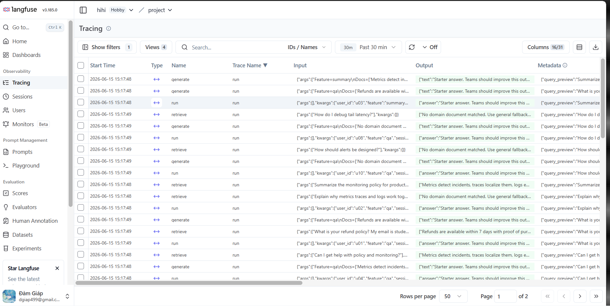

# Evidence Collection Sheet

## Required screenshots
- Langfuse trace list with >= 10 traces
- 
- One full trace waterfall
- 
- JSON logs showing correlation_id
- 
- Log line with PII redaction
- 
- Dashboard with 6 panels
- 
- Alert rules with runbook link
- 
## Optional screenshots
- Incident before/after fix
- Cost comparison before/after optimization
- Auto-instrumentation proof
